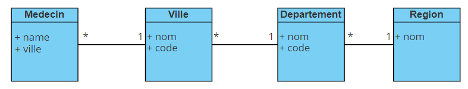

# Champs Imbriqués

## Diagramme de classe


## Formulaire d'ajout

Création du formulaire d'ajout d'un médecin. Le formulaire est rendu avec deux champs (name et region).
Lorsque le formulaire est soumis on ajoute le champ département. Prérempli avec les départements associés à la région sélectionnée.
Lorsque le formulaire est soumis on ajoute le champ ville. Prérempli avec les villes associées à au département sélectionné.
Enfin si le formulaire est encore soumis, il est pris en charge par le controller.

* Entité Médecin et contrainte de validation
```
    #[ORM\Column(length: 255)]
    #[Assert\NotBlank]
    private ?string $name = null;

    #[ORM\ManyToOne]
    #[Assert\NotBlank]
    private ?Ville $ville = null;
```
* Création des champs

- Création d'un champ name (TextType)
- Création d'un champ region (EntityType et non mapped)
- Ajout d'un événement ```FormEvents::POST_SUBMIT``` sur le champ ```region```
- Creation du champ ```departement``` par le FormBuilderInterface
- Ajoute d'un événement ```FormEvents::POST_SUBMIT``` sur le champ ```departement```
- Création d'un champ ville (EntityType et mapped)

```
    public function buildForm(FormBuilderInterface $builder, array $options)
    {
        $builder
            ->add('name')
            ->add('region', EntityType::class, [
                'class' => Region::class,
                'placeholder' => 'Choose a region',
                'mapped' => false,
                'required' => false
            ]);
        $builder->get('region')->addEventListener(FormEvents::POST_SUBMIT, function(FormEvent $event) {
            $region = $event->getForm()->getData(); // region object
            $this->addDepartementField($form->getParent(), $region);
        });
    }
    
    private function addDepartementField(FormInterface $form, Region $region)
    {
        // create builder for field departement
        $builder = $form->getConfig()->getFormFactory()->createNamedBuilder(
            'departement',
            EntityType::class,
            null,
            [
                'class' => Departement::class,
                'placeholder' => 'Choose a departement',
                'mapped' => false,
                'required' => false,
                'auto_initialize' => false, // important
                'choices' => $region ? $region->getDepartements() : [],
            ]
        );
        
        // Add an POST_SUBMIT event on departement field
        $builder->addEventListener(FormEvents::POST_SUBMIT, function(FormEvent $event) {
            $departement =  $event->getForm()->getData();
            if ($departement) {
                $this->addVilleField($event->getForm()->getParent(), $departement);
            }
        });
        
        // add fiels into build to form
        $form->add($builder->getForm());
    }
    
    private function addVilleField(FormInterface $form, ?Departement $departement)
    {
        $form->add('ville', EntityType::class, [
            'class' => Ville::class,
            'placeholder' => 'Choose a town',
            'choices' => $departement ? $departement->getVilles() : []
        ]);
    }
    
    public function configureOptions(OptionsResolver $resolver)
    {
        $resolver->setDefaults([
            'data_class' => Medecin::class
        ]);
    }
```

## Formulaire update

Pour la mise à jour d'un médecin l'évènement ```FormEvents::POST_SET_DATA``` servira ajouter les champs 
avec les valeurs sélectionnées.

```
    public function buildForm(FormBuilderInterface $builder, array $options)
    {
        ...
         $builder->addEventListener(FormEvents::POST_SET_DATA, function(FormEvent $event) {
            $data = $event->getData(); // Medecin Object
            $form = $event->getForm();
            $ville = $data->getVille();
            if ($ville) {
                $departement = $ville->getDepartement();
                $region = $departement->getRegion();
                $this->addDepartementField($form, $region);
                $this->addVilleField($form, $departement);
                $form->get('region')->setData($region);
                $form->get('departement')->setData($departement);
            }
        });
    }
```

## Modification du formulaire via javascript

Le problème de ce type de formulaire est qu'il est rébarbatif surtout lors de la création (soumettre plusieurs fois 
le formulaire...) et peut être confus pour l'utilisateur. 
Pour résoudre ce problème, nous allons laisser le formulaire ajouter tous les champs 
avec des valeurs vide (département et ville). Et utiliser javascript pour préremplir dynamiquement les champs.


Avec cet ajout les champs ```département``` et ```ville``` apparaissent désormais immédiatement dans le formulaire
de création.
Néanmoins, il est toujours nécessaire de valider le formulaire trois fois pour l'envoyer.
```
    public function buildForm(FormBuilderInterface $builder, array $options)
    {
        ...
         $builder->addEventListener(FormEvents::POST_SET_DATA, function(FormEvent $event) {
            $data = $event->getData(); // Medecin Object
            $form = $event->getForm();
            $ville = $data->getVille();
            if ($ville) {
                $departement = $ville->getDepartement();
                $region = $departement->getRegion();
                $this->addDepartementField($form, $region);
                $this->addVilleField($form, $departement);
                $form->get('region')->setData($region);
                $form->get('departement')->setData($departement);
            } else {
                // Add fields departement and ville when create medecin
                $this->addDepartementField($form, null);
                $this->addVilleField($form, null);
        });
    }
```

Coté javascript, création d'un évènement ```change``` sur les champs ```region``` et ```deprtement``` qui enverra 
le formulaire en AJAX au back-end et il ne reste plus qu'à remplacer les ```select``` par les ```select``` prérempli dans 
la réponse.

```
   const ids = [
       'medecin_region',
       'medecin_departement'
   ];
    
    document.addEventListener('change', function(e) {
        if (ids.includes(e.target.id)) {
            let field = e.target;
            let form = field.closest('form');

            let target = '#' + field.id.replace('departement', 'ville').replace('region', 'departement');
            let url = form.getAttribute('action')

            fetch(url, {
                method: 'POST',
                body: new FormData(form)
            }).then(response => {
                return response.text()
            }).then(htmlText => {
                let parser = new DOMParser();
                let html = parser.parseFromString(htmlText, 'text/html');
    
                let newInput = html.querySelector(target);
    
                // field ville is copied with class "is-invalid"
                if (newInput.classList.contains('is-invalid')) {
                    newInput.classList.remove('is-invalid');
                }
    
                form.querySelector(target).replaceWith(newInput)
    
                // clear ville if departement is empty
                if (!form.querySelector('#medecin_departement').value) {
                    let villeInput = form.querySelector('#medecin_ville').cloneNode(false);
                    let option = document.createElement("option");
                    option.setAttribute("value", "")
                    option.innerText = "Choose a town";
                    villeInput.appendChild(option);
                    form.querySelector('#medecin_ville').replaceWith(villeInput)
                }
          })
        }
    })
```
