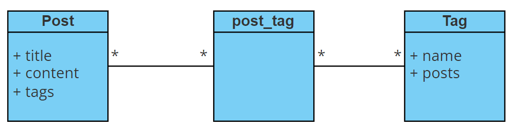

# Champs Personnalisé

## Diagramme de classe
Relation ManyToMany entre Post et Tag.



## Formulaire Parent

Un formulaire classique, dans ce cas le champ ```tags``` sera une ```EntityType```.
(Il faudrait integer une methode ```__toString()``` à ```Tag``` entité ou lui préciser un ```choice_label``` dans 
le formulaire pour que cela fonctionne...)

```
class PostType extends AbstractType
{
    public function buildForm(FormBuilderInterface $builder, array $options)
    {
        $builder
            ->add('title')
            ->add('content')
            ->add('tags')
        ;
    }

    public function configureOptions(OptionsResolver $resolver)
    {
        $resolver->setDefaults([
            'data_class' => Post::class
        ]);
    }
}
```

## Création du champ personnalisé

Le champ étend de  ```AbstractType```

```
class MyCustomtType extends AbstractType
{
}
```
Pour la configuration, on devra préciser que ce formulaire n'est pas composé.
```
class MyCustomtType extends AbstractType
{
    public function configureOptions(OptionsResolver $resolver)
    {
        $resolver->setDefaults([
            'compound' => false
        ]);
    }
}
```

On définira le model de rendu en matchant avec un déjà existant, ici le choiceType. Qui nous générera un ```select```

```
class MyCustomtType extends AbstractType
{
    public function configureOptions(OptionsResolver $resolver)
    {
        $resolver->setDefaults([
            'compound' => false
        ]);
    }
    
    // The block prefix must match with built-in field ChoiceType
    // Will render a Select HTML Element
    public function getBlockPrefix(): string
    {
        return 'choice';
    }
}
```

On devra également définir toutes les valeurs pour le rendu du champ. 
Et lui préciser les valeurs du select dans un tableau. En faisant cela le select ne contiendra que les Tags propres à ce Post

```
class MyCustomtType extends AbstractType
{
    public function configureOptions(OptionsResolver $resolver)
    {
        $resolver->setDefaults([
            'compound' => false
        ]);
    }
    
    // The block prefix must match with built-in field ChoiceType
    // Will render a Select HTML Element
    public function getBlockPrefix(): string
    {
        return 'choice';
    }
    
    // Define all default config for ChoiceType for build view
    public function buildView(FormView $view, FormInterface $form, array $options)
    {
        $view->vars['expanded'] = false;
        $view->vars['placeholder'] = null;
        $view->vars['placeholder_in_choices'] = false;
        $view->vars['multiple'] = true;
        $view->vars['preferred_choices'] = [];
        $view->vars['choices'] = $this->choices($form->getData());
        $view->vars['choice_translation_domain'] = false;
        $view->vars['full_name'] .= '[]'; //modification du nom du champ
        $view->vars['required'] = false;
    }
    
    // Add choices
    private function choices(?Collection $collection)
    {
        return $collection
            ->map(function($tag) {
                return new ChoiceView($tag, (string)$tag->getId(), $tag->getName());
            })
            ->toArray();
    }
}
```

## Création du DataTransformer

Pour finir, il faudra rajouter un DataTransformer pour transformer la Collection de Tag et fais la correspondance 
avec les valeurs du select. Le DataTransformer permet de transformer les data dans les deux sens. Une transformation pour
les rendre dans la vue et l'inverse de la vue jusqu'au model.

- Création du DataTransformer
```
use Symfony\Component\Form\DataTransformerInterface;

class TagToArrayTransformer implements DataTransformerInterface
{
    public function __construct(private EntityManagerInterface $entityManager)
    {
    }

    /**
     * Transforms an object (Collection) to an array.
     * @param Collection $value
     * @return array
     */
    public function transform(mixed $value): array
    {
        if ($value->count() > 0) {
            return $value->map(fn($tag) => (string)$tag->getId())->toArray();
        }

        return [];
    }

    /**
     * Transforms an array to an object (Collection).
     * @param array $value
     * @return Collection
     */
    public function reverseTransform(mixed $value): Collection
    {
        if (empty($value)) {
            return new ArrayCollection([]);
        }

        $tags = $this->entityManager->getRepository(Tag::class)->findBy(['id' => $value]);

        return new ArrayCollection($tags);
    }
}
```

- Ajout du ModelTransformer
```
class MyCustomtType extends AbstractType
{
    public function __construct(
        private TagToArrayTransformer $transformer
    ){}
    ...
    
    public function buildForm(FormBuilderInterface $builder, array $options)
    {
        $builder->addModelTransformer($this->transformer);
    }
}
```

## Utilisation du champ personnalisé dans le formulaire

Utilisation du champ personnalisé

```
class PostType extends AbstractType
{
    public function buildForm(FormBuilderInterface $builder, array $options)
    {
        $builder
            ->add('title')
            ->add('content')
            ->add('tags', MyCustomType::class)
        ;
    }

    public function configureOptions(OptionsResolver $resolver)
    {
        $resolver->setDefaults([
            'data_class' => Post::class
        ]);
    }
}
```
